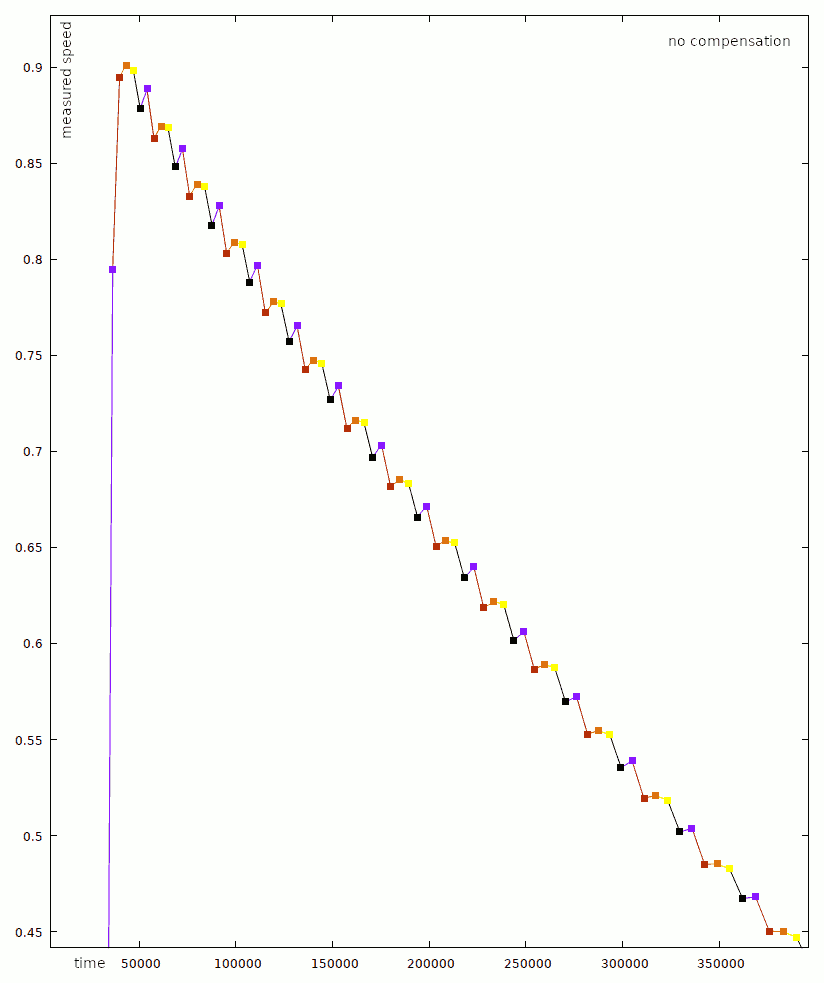
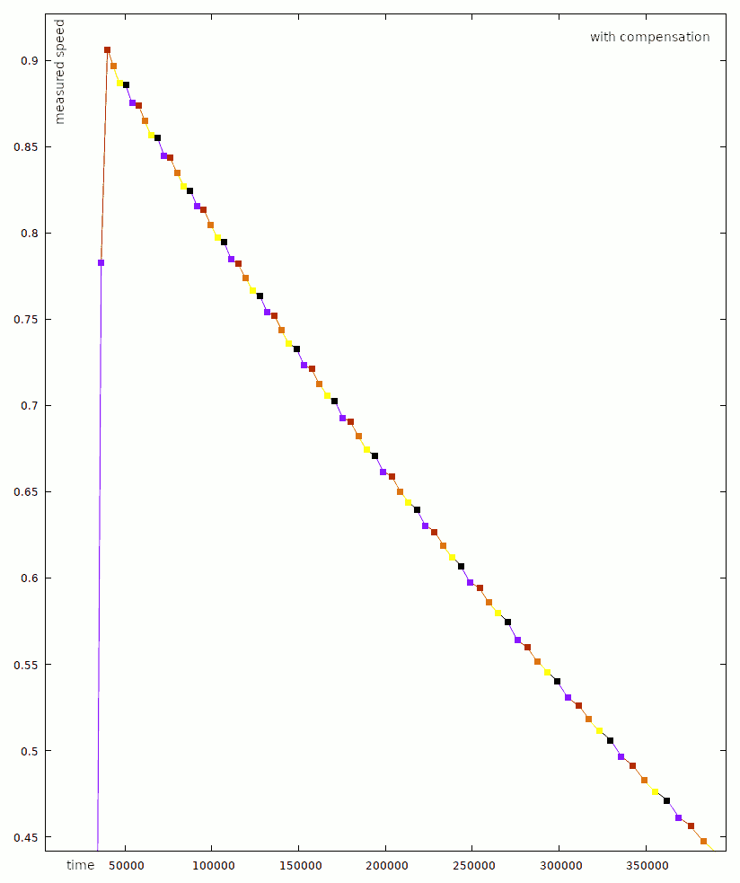

Tretroller
==========

This project is intended to light up a scooter. It offers a almost non-invasive
speed measurement using a hall sensor and a magnet glued to the wheel,
and lots of WS2812b led strips.

A [cheap blue pill](https://hackaday.com/2017/03/30/the-2-32-bit-arduino-with-debugging/)
STM32F103 microcontroller board is used to control everything.

stolen and adapted from https://github.com/hwhw/stm32-projects @ `a1de68cbee09631836c205106fbc2fd64d2a93ec`.
The [original readme has been preserved here](firmware/readme_orig.md)

Features
--------

Hall-sensor based **speed measurement** with software compensation for inaccurately placed magnets enable
light effects synchronized to the driving speed.

**Battery monitoring**: Connect two resistors as follows: `Battery (+) -----[100kOhm]----- PA0 -----[10kOhm]----- GND`.
The firmware will auto-detect the number of LiPo cells. The number of cells is displayed as white dots on the front,
while the current battery estimate is displayed on both sides.

**Battery protection**: If the estimated battery cell voltage drops below 3V, the lights are turned off except for
the front lights, which are dimmed. This reduces power consumption to approx. 50mA.


Hardware Setup
--------------

You need a strong 5V power supply (1-5 ampere, the LEDs consume lots of power), a
blue pill board (or any other STM32F103 board, actually), and a WS2812b LED strip
(preferably a waterproof one, depending on what you want to do with it).
I use a LM2596 DC/DC-converter to generate 5V @ max. 3A from a 3-cell LiPo battery.

Connect the 5V power supply and the GND with the blue pill and with the LED strip.
The LED strip's data in pin goes to PA7, and the tacho input is at PA8.
I use an open-collector hall sensor (A3144, deprecated) with an 1k pull-up.


Building and Flashing
---------------------

```
cd firmware

git submodule update --init
cd libopencm3 && make -j5 && cd ..

cd src
make
stm32flash -w tretroller.bin /dev/ttyUSB0
```

For flashing, you need a USB-serial-converter. Connect its RX/TX pins to PA9/PA10.
(And don't forget GND.)


Learning the magnet distance
----------------------------

It is difficult to glue the magnets perfectly equally spaced and failure to do so
results in a noisy speed estimate. This problem is illustrated in the graphics below,
which show a continuously spinning wheel which is slowly decelerating due to friction.
The colored dots signify which magnet caused the current reading.

 

Easily, one can recognize a repeating jumpy pattern in the left, uncompensated graph,
while the compensation produces a quite smooth graph on the right.

To calibrate the magnet distance, do the following:

Connect the battery and an UART adapter, then run the following command to log the
debug output: `miniterm.py /dev/ttyUSB0 115200 | tee log.txt`

Then, execute `python learn.py log.txt 5`, where 5 is the number of magnets. Note that
this tool discards the first full wheel revolution (in fact, it discards one more pulse),
assuming a steady wheel motion after this.

The last line of the output looks similar to `[64306564, 65027442, 66437832, 65699997, 66208162]`.
Copy this array to `DISTANCES` in `tacho.c` and adjust `N_MAGNETS` in this file.

License
-------

The source code is licensed under the terms of the
[3-clause BSD license](https://opensource.org/licenses/BSD-3-Clause).
This project uses the [libopencm3](https://libopencm3.org/) library, which is
licensed as [LGPL3 or any later version](https://www.gnu.org/licenses/lgpl-3.0.en.html),
so same terms apply to the resulting binary.
